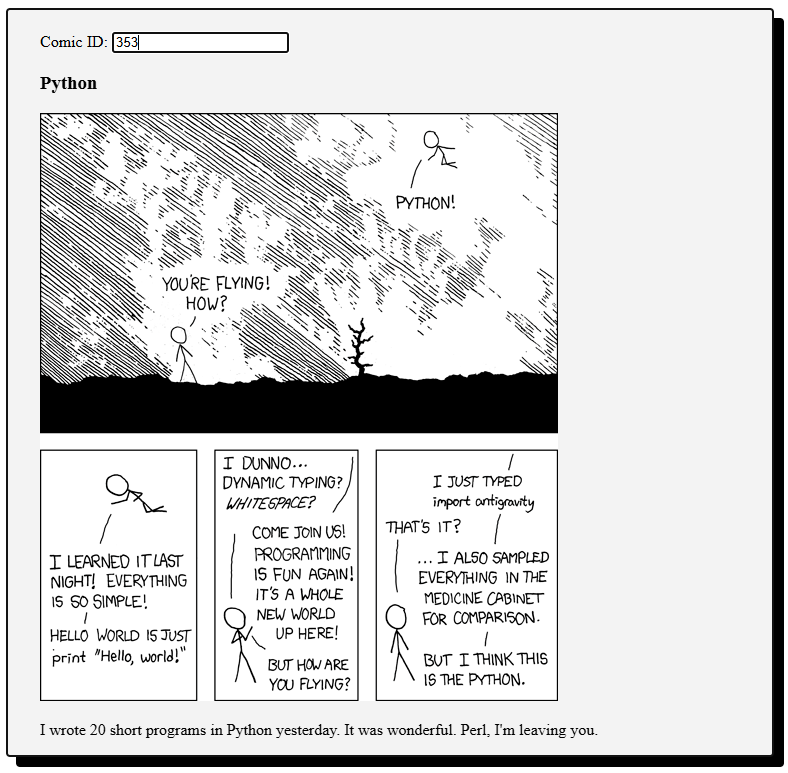

# xkcd in many ways

This project explores progressively more involved methods of retrieving and interacting with data from the xkcd API. From basic scripts to a full web application with a frontend.



## Project Structure


| File           | Description                                                                                                 |
| -------------- | ----------------------------------------------------------------------------------------------------------- |
| 01_basic       | Use `requests` to get retrieve a specific comic from API.                                                   |
| 02_cli_args    | Adds a argument parsing on program execution.                                                               |
| 03_cli_app     | Creates an interactive CLI program.                                                                         |
| 04_file_store/ | Checks if comic is saved locally before fetching and storing it from the API.                               |
| 05_file_db/    | Extracts and locally stores all comic data from the API. New CLI to query based on ID or keywords in comic. | 
| 06_api/        | Serves comics via a FastAPI application.                                                                    |
| 07_frontend/   | Extends FastAPI implementation with a static webpage frontend.                                              |

## Installation

Create virtual environment and launch virtual environment. On Linux:
```sh
python3 -m venv .venv
source .venv/bin/activate
pip install -r requirements.txt
```

## Running the Programs

```sh
python3 01_basic.py
```

```sh
python3 02_cli_args.py <comic_id>
```

```sh
python3 03_cli_app.py
```

```sh
python3 04_file_store/main.py
```

### 05 File Database

First run the extractor to populate an xkcd.json file with comic data from the API.
Then run the main script to start the command line application.

```sh
python3 05_file_db/extractor.py
python3 05_file_db/main.py
```

### 06 API

Serve comic data through a FastAPI backend:

```sh
uvicorn main:app --reload
```

#### Endpoints

| Method | Path           | Purpose                                                 | Example       |
| ------ | -------------- | ------------------------------------------------------- | ------------- |
| GET    | `/`            | Health check & quick usage hint                         | `/`           |
| GET    | `/comics/{id}` | Return the comic with numeric **`id`** from `xkcd.json` | `/comics/123` |


### 07 Frontend & API


```sh
uvicorn main:app --reload
```

Open `07_frontend/public/index.html` html file with live server.


